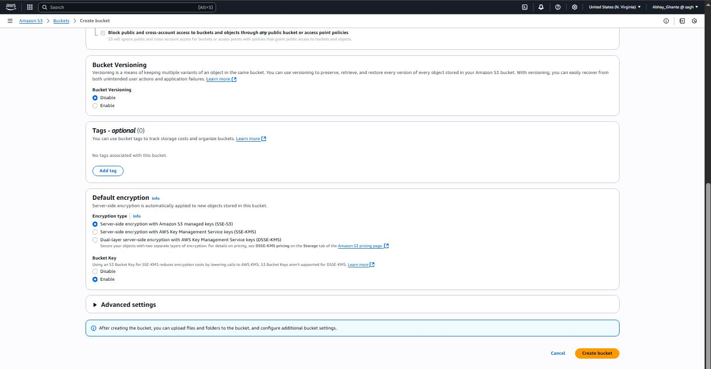
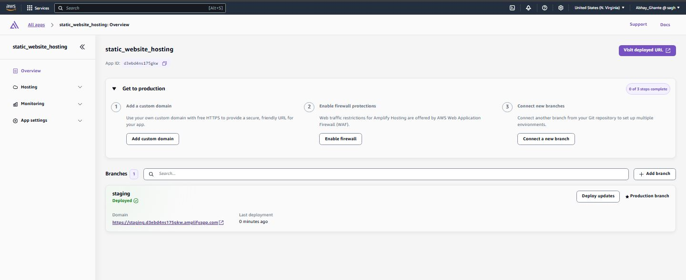
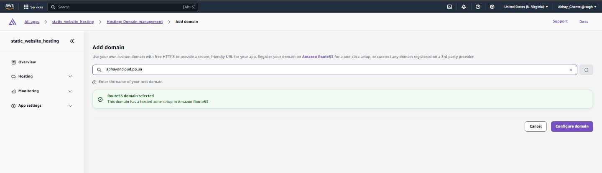

# AWS Static Website Hosting with S3 and Amplify

## 🌟 Introduction

This project demonstrates how to host a static website using **AWS S3** and **AWS Amplify** services. This approach provides a scalable, cost-effective solution for deploying static web applications with enhanced features like custom domains and SSL certificates.

### Key Benefits:

- 🚀 **High Performance** - Global content delivery through AWS infrastructure
- 💰 **Cost-Effective** - Pay only for what you use
- 🔒 **Secure** - Built-in SSL/TLS encryption
- 🌐 **Custom Domains** - Easy domain management and configuration
- 📈 **Scalable** - Automatically handles traffic spikes
- 🛡️ **WAF Integration** - Web Application Firewall protection available

### Technologies Used:

- AWS S3 (Simple Storage Service)
- AWS Amplify
- HTML/CSS/JavaScript
- Custom Domain Management
- Web Application Firewall (WAF)

---

## 📋 Prerequisites

Before starting this project, ensure you have:

- An active AWS account
- Basic understanding of AWS services
- A static website (HTML, CSS, JS files)
- Optional: A custom domain name

---

## 🚀 Implementation Steps

### A. Code Download

1. **Download the project code from GitHub**
   
   Navigate to the repository and download the code as a ZIP file to your local machine:
   
   ```bash
   # Repository URL
   https://github.com/AbhayGhante/aws-static-web-hosting
   ```

- [ ] Alternatively, you can clone the repository:
  
  ```bash
  git clone https://github.com/AbhayGhante/aws-static-web-hosting.git
  ```


---

### B. S3 Configuration

#### 1. Create S3 Bucket

Navigate to the S3 dashboard in your AWS Console and create a new S3 bucket:


- Click on **"Create bucket"**
- Provide a globally unique name for your S3 bucket
- Select your preferred AWS region
- Click **"Create bucket"**

```bash
# Example bucket naming convention
bucket-name: your-project-name-static-website-2025
```




#### 2. Upload Website Files

Upload all your website files to the newly created S3 bucket:

- Click on the **"Upload"** button
- Select all files from your downloaded/cloned project
- Ensure all HTML, CSS, JS, and asset files are uploaded
- Click **"Upload"** to complete the process

```bash
# Typical file structure
├── index.html
├── 404.html
├── css/
│   └── styles.css
├── js/
│   └── script.js
└── assets/
    └── images/
```


#### 3. Enable Static Website Hosting

Configure your S3 bucket for static website hosting:

- Navigate to **Properties** tab
- Scroll down to **"Static website hosting"**
- Click **"Edit"**
- Enable static website hosting
- Set **Index document**: `index.html`
- Set **Error document**: `404.html`
- Save changes


#### 4. Configure Public Access

Modify bucket permissions to allow public access:

- Go to **Permissions** tab
- Edit **"Block public access settings"**
- Uncheck all blocking options to allow public access
- Save changes
- Add a bucket policy for public read access:

```json
{
  "Version": "2012-10-17",
  "Statement": [
    {
      "Sid": "PublicReadGetObject",
      "Effect": "Allow",
      "Principal": "*",
      "Action": "s3:GetObject",
      "Resource": "arn:aws:s3:::your-bucket-name/*"
    }
  ]
}
```


#### 5. S3 Configuration Complete

Your S3 bucket is now configured for static website hosting. You should have a working website URL provided by S3.


---

### C. AWS Amplify Integration

AWS recommends using **AWS Amplify** for hosting static websites as it provides additional features such as:

- Custom domain management
- SSL/TLS certificates
- WAF (Web Application Firewall) integration
- CI/CD capabilities

#### 1. Create New Amplify App

Navigate to the AWS Amplify dashboard:

- Click on **"Create new app"**
- Choose your deployment method


#### 2. Configure Deployment Method

**Step 1: Choose Create Method**

- Select **"Deploy without Git"** for manual deployment


**Step 2: Start Manual Deployment**

- Provide a descriptive name for your application
- Select **"Amazon S3"** as the deployment method
- Browse and select the S3 bucket created in previous steps
- Click **"Save and Deploy"**

```bash
# Application naming example
App name: aws-static-website-hosting-demo
Environment: staging
```




#### 3. Add Custom Domain (Optional)

If you have a custom domain, you can configure it:

- Click on **"Add domain"** in your Amplify app dashboard
- This step is optional but recommended for production websites


#### 4. Configure Domain Settings

Enter your domain configuration:

- Input your **custom domain name**
- Click **"Configure domain"**
- Choose SSL certificate option:
  - **Amplify managed certificate** (recommended for most users)
  - **Custom SSL certificate** (if you have your own)
- Click **"Add domain"** to complete the setup

```bash
# Domain configuration example
Domain: yourdomain.com
Subdomain: www (optional)
SSL: Amplify managed certificate
```




#### 5. Enable WAF Protection (Recommended)

For additional security, enable Web Application Firewall:
Navigate to WAF settings in Amplify console


Enable protection against DDoS attacks,
Configure rate limiting and IP filtering as needed


#### 6. Deployment Complete

Your static website is now successfully hosted using AWS S3 and Amplify with the following features:

- ✅ Global content delivery
- ✅ HTTPS encryption
- ✅ Custom domain (if configured)
- ✅ Automatic scaling


---

## 🎯 Final Results

Your static website is now live and accessible through:

- **S3 Website URL**: `http://your-bucket-name.s3-website-region.amazonaws.com`
- **Amplify URL**: `https://your-app-id.amplifyapp.com`
- **Custom Domain** (if configured): `https://yourdomain.com`

---

## 📝 Key Considerations

### Security Best Practices:

- Always use HTTPS in production
- Regularly review and update bucket policies
- Monitor access logs for unusual activity

### Performance Optimization:

- Enable CloudFront for better global performance
- Optimize images and assets for web delivery
- Implement proper caching strategies

### Cost Management:

- Monitor S3 storage and data transfer costs
- Set up billing alerts for unexpected charges
- Consider S3 storage classes for cost optimization

---

## 🔧 Troubleshooting

### Common Issues:

1. **403 Forbidden Error**: Check bucket policy and public access settings
2. **404 Not Found**: Verify index.html file exists and is properly named
3. **SSL Certificate Issues**: Allow time for certificate provisioning (up to 24 hours)

### Useful AWS CLI Commands:

```bash
# Sync local files to S3 bucket
aws s3 sync ./website s3://your-bucket-name

# List bucket contents
aws s3 ls s3://your-bucket-name --recursive

# Check bucket policy
aws s3api get-bucket-policy --bucket your-bucket-name
```

---

## 📚 Additional Resources

- [AWS S3 Static Website Hosting Documentation](https://docs.aws.amazon.com/AmazonS3/latest/userguide/WebsiteHosting.html)
- [AWS Amplify Documentation](https://docs.aws.amazon.com/amplify/)
- [AWS CLI Reference](https://docs.aws.amazon.com/cli/)

---

## 🤝 Contributing

Feel free to contribute to this project by:

- Reporting issues
- Suggesting improvements
- Submitting pull requests.


